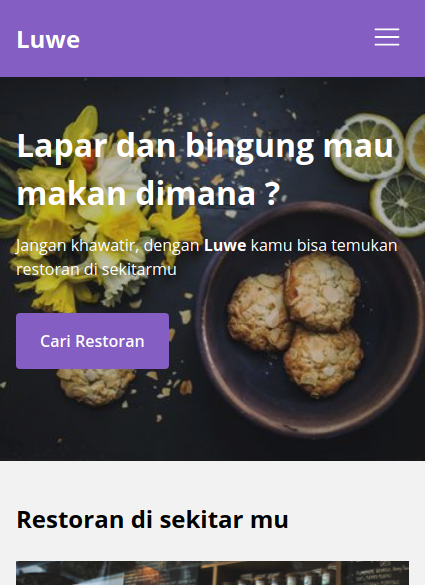

  

<h1 align="center">
  Dendy Dharmawan
</h1>

  <a href="https://dendydharmawan.vercel.app/" target="_blank">dendydharmawan.vercel.app</a>

# Luwe Apps - Temukan Restoran di Sekitarmu !

Lapar dan bingung mau makan dimana ?

Jangan khawatir, dengan Luwe kamu bisa temukan restoran di sekitarmu dan melihat menu apa saja yang mereka sediakan. Disini kamu dapat menambahkan restoran yang menjadi favoritmu.

 

  

 

 
 

## Development
Website ini dikembangkan menggunakan bahasa pemrograman HTML, CSS, dan Javascript. Tampilan antarmuka di design tanpa menggunakan bantuan library. Menggunakan optimasi Progressive Web Apps sehingga mampu memberikan pengalaman layaknya aplikasi mobile.

Data dari restoran menggunakan data yang disediakan oleh https://restaurant-api.dicoding.dev/ . Karena ini merupakan hasil dari pembelajaran saya pada course <b>Menjadi Front-End Web Developer Expert</b>.

- Client-side storage by IndexedDB API v6.1.2
- Lazyload by lazysizes v.5.3.2
- CSS reset by normalize.css v8.0.1
- Image resizer by Sharp v0.28.3
- TDD by Jasmine v3.5.0
- E2E Testing by Codeceptjs v3.0.7

 

